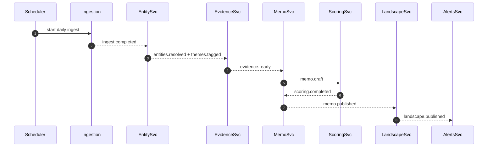
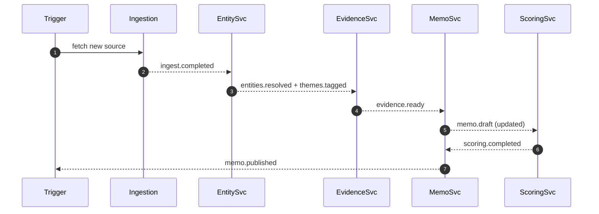
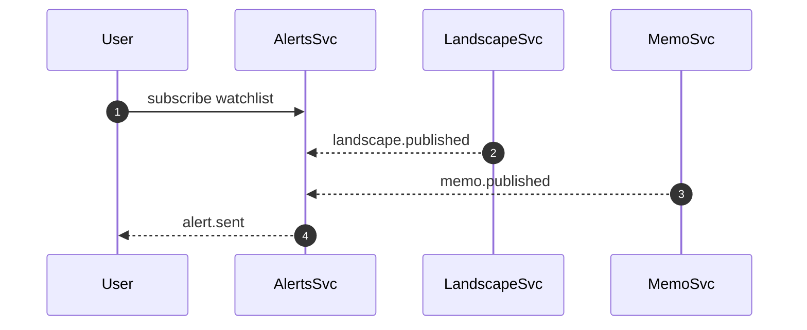

# Sequence Diagrams (Draft)

## 1) Daily Research Cycle

```mermaid
sequenceDiagram
  autonumber
  participant Scheduler
  participant Ingestion
  participant EntitySvc
  participant EvidenceSvc
  participant MemoSvc
  participant ScoringSvc
  participant LandscapeSvc
  participant AlertsSvc

  Scheduler->>Ingestion: start daily ingest
  Ingestion-->>EntitySvc: ingest.completed
  EntitySvc-->>EvidenceSvc: entities.resolved + themes.tagged
  EvidenceSvc-->>MemoSvc: evidence.ready
  MemoSvc-->>ScoringSvc: memo.draft
  ScoringSvc-->>MemoSvc: scoring.completed
  MemoSvc-->>LandscapeSvc: memo.published
  LandscapeSvc-->>AlertsSvc: landscape.published
```

## 2) Catalyst-Driven Memo Refresh

```mermaid
sequenceDiagram
  autonumber
  participant Trigger
  participant Ingestion
  participant EntitySvc
  participant EvidenceSvc
  participant MemoSvc
  participant ScoringSvc

  Trigger->>Ingestion: fetch new source
  Ingestion-->>EntitySvc: ingest.completed
  EntitySvc-->>EvidenceSvc: entities.resolved + themes.tagged
  EvidenceSvc-->>MemoSvc: evidence.ready
  MemoSvc-->>ScoringSvc: memo.draft (updated)
  ScoringSvc-->>MemoSvc: scoring.completed
  MemoSvc-->>Trigger: memo.published
```

## 3) Alert Trigger Flow

```mermaid
sequenceDiagram
  autonumber
  participant User
  participant AlertsSvc
  participant LandscapeSvc
  participant MemoSvc

  User->>AlertsSvc: subscribe watchlist
  LandscapeSvc-->>AlertsSvc: landscape.published
  MemoSvc-->>AlertsSvc: memo.published
  AlertsSvc-->>User: alert.sent
```

